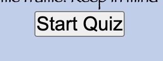
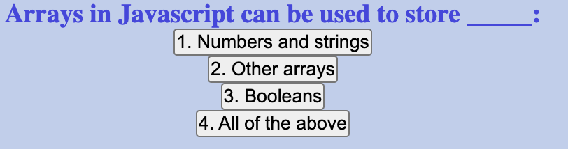
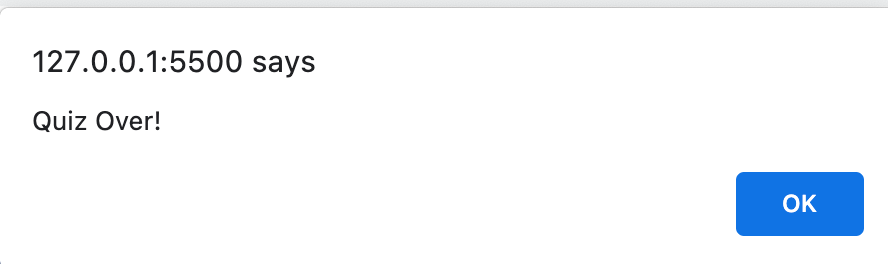
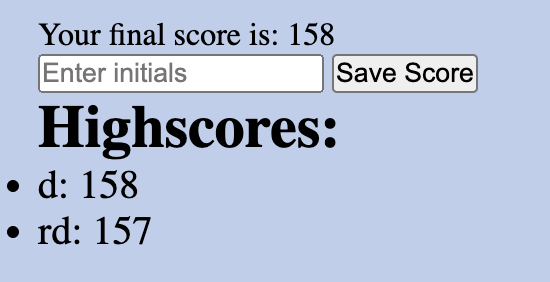

Code Quiz 

## Description
The motivation behind the project was to create a code quiz for people to test their knowledge of different topics in Javascript. We built this project to be able to test for the correct answers of the questions to ultimately generate a score for the person taking the quiz and see how they do in a specified time frame and incorrect answers will deduct time from the quiz. The questions must be answered within that timeframe. It solves the problem of being able to utilize the quiz so they can input what they think the correct answer is and seeing if it matches the actual answer. I learned a lot about creating time intervals in javascript, as well as how to manipulate css, html and javascript together so that each part can work hand in hand to create a working code. I also learned a lot about appending elements, storing data into a local storage, and using JSON parse. 

## Usage

This website can be used by first clicking the Start Button on the quiz to be showcased a series of questions that must be answered on javascript. You answer each question by clicking on the answer that you believe is correct which will prompt you to the next question until all questions are answered. If the answer is inccorect, time will be deducted. Your answers will be stored at the end which will generate a score for you quiz as well as an option to input your initials which will be recorded in a highscores list. 

 

Instructions for ![QuizStartButton]: When you click on the Start Button, you will be prompted to a series of questions relating to javascript.
Instructions for ![Questions]: You will have to click on an answer from the list of choices 
Instructions for ![QuizTimer]: This timer shows the amount of time you have left on your quiz 
Instructions for ![QuizOverAlert]: You will be alerted with a quiz is over statement when the quiz is over in which you can press ok 
Instructions for ![Scores]: Your scores will be generated and you can click save score after putting your initials down which will be saved under highscores.

Link to live site of the quiz: https://rosiedeng1.github.io/Code-Quiz-Assignment/

## Credits

How to add an event listenter: https://www.w3schools.com/js/js_htmldom_eventlistener.asp
How to set time intervals: https://www.w3schools.com/jsref/met_win_setinterval.asp
How to get element by ID: https://www.w3schools.com/jsref/met_document_getelementbyid.asp

## License

Please refer to the LICENSE in the repo.

